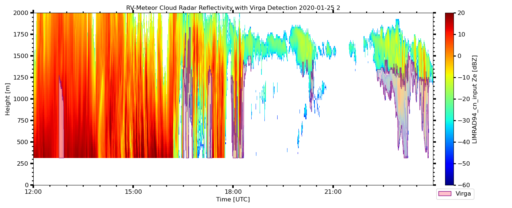

# Changelog

## Version 0.3.4

* masking rain by *flag_surface_rain* or lowest range gate reflectivity is now applied only to the lowest cloud layer
* cloud detection and virga detection is strongly sensitive to allowance of gaps in the radar reflectivity via the thresholds **virga_max_gap** and **ze_max_gap**. In previous version only 
  **virga_max_gap** was used for both, but is now split for more fine tuning of cloud detection and at the same time allow for larger gaps in virga to capture also fall streak events.
* quicklook and plotting routines are accessible as xarray Dataset accessor via 
  ```
  import virga_sniffer
  output_dataset = virga_sniffer.virga_mask(input_dataset, config)
  output_dataset.vsplot.quicklook_full()
  ```
* rename output dataset:
    * CBH : cloud_base_height
    * CTH : cloud_top_height
* new/adjusted variables:
    * flag_virga_layer - like flag_virga but separated for each cloud layer
    * flag_cloud - flags range gates between cloud bases and tops
    * flag_cloud_layer - like flag_virga_layer but for clouds
    * virga_depth
      * **calculated from lower edge of lowest range gate  with virga to upper edge of top range gate with virga**
      * **virga_depth now excludes range gates where radar reflectivity is nan or 0**
    * virga_depth_maximum_extend - like virga_depth, but including gaps (maximum geometric extend)
    * virga_top_height
    * virga_base_height
    * cloud_top_rg - index of rangegate where cloud top is located
    * cloud_base_rg  - index of rangegate where cloud base is located
    * virga_top_rg - index of rangegate where virga top is located
    * virga_base_rg  - index of rangegate where virga base is located
* new example
  * Added interactive demonstration of virga_sniffer config as jupyter notebook
* Changes in default configuration
  * ```require_cbh=True```: need a cloud base to be considered as virga?
  * ```mask_below_cbh=True -> removed```: virga is always below cloud base
  * ```mask_connect=True -> ignore_virga_gaps=True```: the behaviour has changed and the flag is now used to switch between ignore gaps for virga mask or not
  * ```virga_max_gap=150 -> virga_max_gap=700```: [m] maximum gap between radar reflectivity values to count as connected virga.
  * ```**ze_max_gap=150**```: [m] former **virga_max_gap** but now used only for cloud detection / connection.
  * ```cbh_layer_fill=True```: fill gaps of cbh layer?
  * ```layer_fill_limit=1 -> cbh_fill_limit=60```: [s] fill gaps of cbh layer with this gap limit (changed units from min to s)
  * ```cbh_ident_function -> cbh_processing```
  * ```mask_minrg -> minimum_rangegate_number```
  * ```mask_zet -> mask_rain_ze```

---

## Version 3 (0.3.3)
From version 2 to version 3 the Virga-Sniffer receives a general overhaul, which basically reworks everything from the base version 0.2.0 and adds more functionality like flexible input data, multi-cloud-layer handling, etc.. Updates and General workflow with indication of changes will be summarized below. Explanation of functions, thresholds, etc. will be given in the documentation.

### Virga Sniffer v3 workflow
1. Unify data timesteps (reference radar)
2. Cloud base/top height preprocessing
3. Virga identification (Virga mask for radar data)
4. Output timeseries as v2
    (**TODO**: Collection data)
    (**TODO**: Homogenized Output, with metadata (netCDF?)

Along with input data, the virga identification is tweaked by a number of empirical thresholds, which are summarized here with their default values (version: 3b):
* ```smooth_window_cbh=60```: [s] smoothing of CBH
* ```smooth_window_lcl=300```: [s] smoothing of LCL if provided
* ```require_cbh=True```: need a cloud base to be considered as virga?
* ```mask_below_cbh=True```: virga if below cbh?
* ```mask_rain=True```: apply rain mask from ancillary data?
* ```mask_zet=True```: apply rain mask from radar signal?
* ```ze_thres=0```: [dBz] minimum Radar signal at lowest range-gate which is considered rain
* ```mask_connect=True```: apply virga mask cleaning regarding cbh layers
* ```mask_minrg=2```: minimum number of range-gates in column to be considered virga
* ```mask_vel=True```: apply velocity mask ?
* ```vel_thres=0```: [ms-1] velocity threshold
* ```mask_clutter=True```: apply clutter threshold line ?
* ```clutter_c=-8```: [ms-1] intercept of clutter threshold line
* ```clutter_m=4```: [ms-1 dBz-1] slope of clutter threshold line
* ```layer_threshold=500```: [m] cbh layer separation
* ```virga_max_gap=150```: [m] maximum gap between virga signal to count as connected virga and for clouds to cloud base
* ```clean_threshold=0.05```: [0-1] remove cbh layer if below (clean_treshold*100)% of total data
* ```cbh_layer_fill=True```: fill gaps of cbh layer?
* ```cbh_fill_method='slinear'```: fill method of cbh layer gaps
* ```layer_fill_limit=1```: [min] fill gaps of cbh layer with this gap limit
* ```cbh_ident_function=[1,0,2,0,3,1,0,2,0,3,4]```: order of operations applied to cbh: 0-clean, 1-split, 2-merge, 3-add-LCL, 4-smooth


### General Updates/Changes
* remove pylarda dependency
* use xarray and pandas (pandas for datetime handling)
* reference time: radar data (v2: reference time ceilometer)
    * **TODO**: evaluate correct interpolation with different input data (handling of filling/nan values)
* Input/Output are xarray.DataArray
* Input Data:
    * required: 
      * radar reflectivity [dBz]
      * ceilometer cloud-base height [m], multi layer
    * optional:
      * doppler velocity [m s-1]
      * lifting condensation level [m]
      * rainflag [bool]
* In contrast to v2, v3 is build with modularity in mind, meaning that optional Input data is not required to calculate a robust virga mask. Nevertheless, the probability of false positive is considerably higher with less information. (v2: Input for virga mask was: radar reflectivity, ceilometer CBH (1st layer), rainflag)
    

### 1. (New) Cloud base/top height preprocessing
Version 2 uses the first layer of ceilometer detected cloud-base height (CBH). In this version multi layer handling is implemented. The ceilometer CBH introduces some issues to the former version, which are now resolved as follows:
* frequent jumping / noisy data in one cloud layer: CBH smoothing
* gaps in clouds introduces jumps to higher cloud layers, resulting in cut off virga events in higher cloud layers: CBH layer identification and merging

First, the multi layer CBH data is smoothed using a rolling median window of ```smooth_window_cbh``` seconds.

Then, the smoothed CBH data is preprocessed using two iterations of the following functions:
1. CBH layer split
2. CBH layer clean
3. CBH layer merge
4. CBH layer clean
5. LCL merged to the first CBH layer (fill gaps)

Afterwards, the CBH layer data is smoothed a second time using a rolling median window of ```smooth_window_cbh``` seconds.

Finally, layer gaps < ```layer_fill_limit``` are filled by ```cbh_fill_method``` interpolation. 

**CBH layer split**:
This function identifies jumps in CBH layer data and separates this data, by creating more layers. Here the empirical threshold ```layerthreshold``` is used. The CBH layer data is iterated until no new layers are added. Starting with the lowest layer, each layer is processed as follows: 
1. calculate layer mean height
2. data of CBH values > (mean + layerthreshold) are pushed to a new layer on top of current layer
3. data of CBH values < (mean - layerthresholf) are pushed to a new layer below the current layer

Therefore, the number of layers can increase a lot, but it is ashured, that they separate by at least ```layerthreshold```.

**CBH layer merge**:
Compares every CBH layer with layers above, and merge if the data of both is within ```layerthreshold```. This is required, as CBH layer split can result in several layers of same CBH, if origninal data input is multi layer.

**CBH layer clean**:
Due to CBH layer split and merge, outliers are caught in separate layers. Therefore, outliers in ceilometer data are effectively removed using CBH layer clean, where layers with valid number of datapoints < ```clean_threshold```% are dropped. Additionally, CBH layer data is resorted by the layer mean height.

**LCL merge**:
If LCL is provided as ancillary input data, the data is used to fill the gaps of the lowest CBH layer resulting in a continuose lowest CBH layer. The LCL input data is smoothed before using rolling median of a ```smooth_window_lcl``` seconds window.


### 2. (Update) Virga identification
To identify Virga a number of differenc checks are applied. These checks are summarized below in the same order they are applied in the virga sniffer. In addition, (Adapted),(Update) or (New) indicate if these checks have been adapted, updated or added to from version 2 to 3:

**(Update) Radar signal present**:
Potential virga if radar signal
  * Requires any radar signal to be counted as virga
    (v2: radar signal was also an requirement, but only to identify timesteps allowing also for large gaps in radar signal)

**(New) Check Virga Connection**:
Assign Virga to CBH and assign a cloud top height estimate, handle (vertical) gaps in Virga signal.
  * Applied if ```mask_connect```
    * If not applied, CTH == CBH (cloud depth cannot be retrieved)
  * Loop through cbh layers (bottom to top) and:
    * remove from virga mask, if the signal connects on top of the cbh layer (probably cloud), but not to the next cbh layer
    * remove cbh layer if virga connects through this layer to the next cbh layer 
  * Checking connection of virga has a margin of ```virga_max_gap``` to ignore small gaps
  
**(Update) Potential Virga if below CBH**:
Only data below a CBH is considered for Virga
  * added processing of multi CBH layer

**(TODO) Remove Virga signal if between CBH and CTH**:
not implemented yet, but also not observed yet. Required?

**(Update) DWD-Rainflag**: No Virga in column if True
  * True if any rain detected in timestep, no padding 
    (v2: same but 10min after rain was additionally flagged as rain)
  * **TODO**: should be "No Virga below first cloud-base layer if True, not entiry column"

**(Update) Rainflag based on radar reflectivity**:
If radar reflectivity in the lowest available range gate is present and the reflectvity value > ```ze_thres``` dBz, exclude this timestep as the droplets are considered to reach the surface.
    * **TODO**: should be "No Virga below first cloud-base layer if True, not entiry column"
    * (v2: was cecking lowest rangate with a signal and not if the lowest range gate has a signal, causing virga at higher layers to be deleted)
    
**(Adapted) Check number of range-gates with data**:
If to less data, excelude this timestep because its probably clutter.
   * If number of range-gates with data < ```mask_minrg```, exclude timestep
   * **TODO**: At this stage the entire column is checked at once, consider virga from different layer separately

**(New) Potential Virga if doppler velocity below threshold**:
Consider as Virga if doppler velocity is below ```vel_thres``` (Negative values are considered as falling droplets)

**(New) Mask Clutter**:
Remove certain Signal+Velocity combinations.
 * This Eq has to be fullfilled to be considered as virga: velocity > Ze*(-```clutter_m```) + ```clutter_c```
 * This is to remove combinations of low signal + high falling speeds, which are mainly observed in situations of false signal.
 * **TODO**: Indepth investigation of these situations, is it really false signal?

### Output
* (Update) Timeseries
  * Column "max_velocity"-values: maximum negative Doppler velocity (towards radar) 
    (v2: maximum positive Doppler velocity (away from radar))
  * Added column "rain_flag": Values=True if ancillary rainflag data yields True (DWD-Data is used here)
* **TODO**: Collection

---

## Version 2

Virga Sniffer v2  (v0.2.0 release)
  
Implemented improvements after discussion with Heike and Sebastian on 23. November 2021.  
  
- Do not read in first radar range gate as it contains unfiltered clutter.  
- Use heave corrected radar data.  
-> This introduced a problem with the velocity data. Since the final step in the heave correction is to apply a rolling mean over the Doppler velocity, not every Ze value has a corresponding Doppler velocity. Thus, the statistics on the velocity are sometimes all nan, even though there is reflectivity observed.  
- The masked values (no signal = -999) in the reflectivity and velocity data are replaced by 0 to minimize their influence on the interpolation on the ceilometer time.  
- Instead of interpolating the cloud_bases_tops variable the function is applied again after the interpolation.  
- The function find_bases_tops had a bug which prevented it from detecting a cloud base for a cloud which started in the first range gate. This has been fixed. This was probably the cause for some weird statistics as in such cases the last (upper most) range gate was classified as cloud top and no cloud base was classified.  
- Using the new heave corrected radar data brought  a change in unit. Reflectivity is now read in as dBZ already and not in linear units. -> Everything is adjusted to that but the variable names stay the same.  
- Add more profile statistics for reflectivity (dBZ and linear), velocity and the gradient of both.  
- Change the time interval on the temporary quality check quicklooks.  
- Increase minimum virga time to 80 timesteps (~4 minutes for first chirp table/~2 minutes for later chirp table).  
- Add start and end date (unix, formatted) to virga statistics.  
- Add version to quicklooks.
- Included new profile statistics in csv file

---

## Version 1
Readme/documentation from version 1:

### Used Instruments and Variables

* LIMRAD94, 94 GHz Doppler cloud radar $\rightarrow$ Radar Reflectivity
* CHM15k, ceilometer $\rightarrow$ cloud base heigth of first detected cloud base
* WS100-UMB, DWD rain sensor $\rightarrow$ rain flag

### Virga Detection

Good Morning everyone, I spent yesterday making a virga sniffer for the campaign by utilizing the ceilometer cloud base height and the radar reflectivity Ze. The first runnable script is done and I will open a new repository with it in our remsens-lim Github account at one point. The routine goes through 5 steps:

1. Find virga in each time step
2. create virga mask
3. detect single virga and define borders
4. evaluate statistcally -> output like cloud sniffer in csv file
5. plot radar Ze with virga in boxes (optionally)

A virga is thereby defined when the ceilometer cloudbase differs from the height of first radar range gate, which shows a signal.  Their difference has to be at least 23m, which is the range resolution in the first chirp.  Furthermore, I included a rainflag from the DWD sensor. If rain is detected in a time step, no virga can be present. Also 10 minutes after the last rain the data is flagged. As a given the radar has to detect a signal at all. 

In the second step I then create a mask with pixels defined as virga = 1 and 0 otherwise. The third step takes that mask and loops through it. A virga has 

- a minimum vertical extent of 3 range gates (70 - 120 m depending on chirp)
- a minimum horizontal extent of 20 time steps (60 - 80 s depending on chirptable)
- a maximum gap of 10 timesteps is allowed inside the virga (30 - 40 s depending on chirptable)

I then save the borders as a tuple (time, lower range gate, upper range gate) and in a few different formats for easier plotting.  Using these borders I select each virga and compute some statistics about it and save everything to a csv file, similar to the cloud sniffer files from Johannes Bühl.

The analysis runs on a daily basis. Daily csv files and plots can be found here: `/projekt2/remsens/data_new/site-campaign/rv_meteor-eurec4a/virga_sniffer` I included two nice examples. (I always plot half a day for visibility)

Further steps can (must) be:

- I just discovered an error, when I have rain free days, need to fix that (Done, was an error in reading in the DWD csv file)
- merge daily csv files and derive statistics for whole campaign such as how often do we have virga, average depth, max/min Ze, relation between number of clouds and number of virga
- adjust routine to be run for any campaign using different rainflags (HATPRO)
- virga detection in upper chirps with 2nd and 3rd cloud base



### First Comments Heike

In all but one occasion I would call it a virga: Feb25, 12:45 UTC: LIMRAD94 Ze is near saturation so it seems strange that there should be a virga. maybe such erroneous virga classifications can be filtered by applyling a radar Ze-gradient filter: If Ze does not decrease from virga top to bottom, then it shouldn't be defined as virga. probably/maybe some vertical range gate smoothing in the Ze is needed for that. Other option: if there is Ze in first range gate and Ze(first_range_gate) > threshold (0 dbZ? 5dBZ?), then there is also no virga but some other reason why first echo of Ze is below first ceilometer CBH. 

### First Corrections

#### 1. Using a gradient filter

checked if Ze increased from bottom to top of virga, if not -> not a virga


**Result:** Basically no virga would be left.

#### 2. Using a Ze threshold filter 

A virga should have a low reflectivity in general. Thus, the first Ze detected should be below $0$ dBZ.


**Result:** Looks good. The erroneous virga is removed. But the others are kept.

### Additions for Sebastian Los

Sebastian Los (University of New Mexico) can make use of a few extra variables for each profile, thus an extra csv file is created.